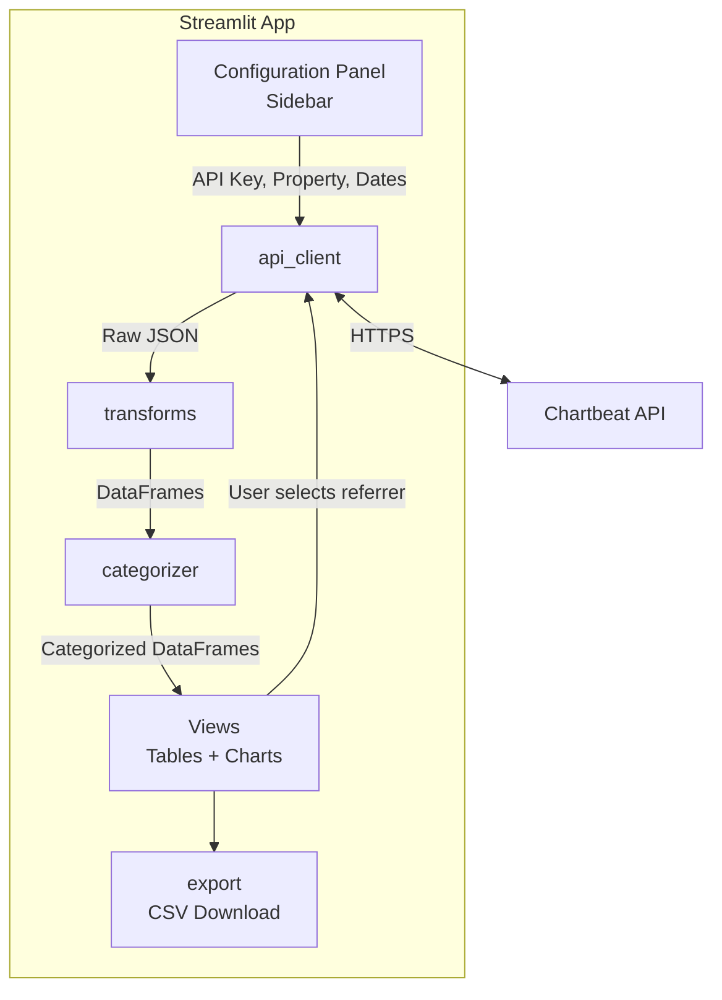

# Design Document: Chartbeat Referrer Dashboard

## Overview

This design describes a single-page Streamlit application that connects to the Chartbeat Historical Analytics API, retrieves referrer and URL-level performance data, categorizes referrers into logical groups, and presents the results through interactive tables and charts with CSV export capability.

The application is structured as a set of Python modules:

- **`app.py`** — Streamlit entry point; renders the sidebar configuration panel, orchestrates data fetching, and displays views.
- **`api_client.py`** — Thin wrapper around `requests` for calling the Chartbeat Historical Analytics API. Handles authentication, pagination, and error mapping.
- **`categorizer.py`** — Pure-function module that maps a referrer string to a `Referrer_Category` using a rules engine (ordered list of matchers).
- **`transforms.py`** — Pure-function module for data shaping: aggregation by category, section extraction from URLs, and metric computation.
- **`export.py`** — CSV formatting and download helpers.

### Key Design Decisions

| Decision | Rationale |
|---|---|
| Streamlit (not Dash/Flask) | Requirement specifies Streamlit; rapid prototyping, built-in session state, native download button |
| `requests` for HTTP | Lightweight, no async needed for a single-user dashboard |
| Pure-function categorizer | Enables property-based testing; no side effects |
| Ordered rule list for categorization | Allows priority-based matching (e.g., AMP pattern before Direct/Other fallback) |
| pandas DataFrames for data | Natural fit for Streamlit tables, sorting, filtering, and CSV export |

## Architecture



### Data Flow

1. User fills in the Configuration Panel (API key, property, start date, end date).
2. On submit, `api_client` calls the Chartbeat `/referrers/` endpoint with query parameters.
3. Raw JSON response is converted to a pandas DataFrame in `transforms`.
4. `categorizer` adds a `category` column by applying rules to each referrer string.
5. `transforms` computes aggregated metrics per category and per referrer.
6. Streamlit renders summary tables, detail tables, and bar charts.
7. When the user selects a specific referrer, `api_client` calls the URL-level endpoint.
8. `transforms` extracts the "Section" column from each URL's first path segment.
9. Export buttons convert the current DataFrame to CSV via `export`.

## Components and Interfaces

### 1. `api_client.py`

```python
class ChartbeatClient:
    """Stateless HTTP client for the Chartbeat Historical Analytics API."""

    def __init__(self, api_key: str, host: str):
        """
        Args:
            api_key: Chartbeat API key (passed as `apikey` query param).
            host: The property/domain to query (e.g., "example.com").
        """

    def get_referrers(self, start: datetime, end: datetime) -> list[dict]:
        """Fetch referrer-level metrics for the date range.

        Returns:
            List of dicts with keys: referrer, total_stories,
            total_engaged_min, avg_engaged_min, page_views,
            quality_page_views, uniques.

        Raises:
            ChartbeatAPIError: On HTTP or auth errors.
        """

    def get_urls_for_referrer(
        self, referrer: str, start: datetime, end: datetime
    ) -> list[dict]:
        """Fetch URL-level metrics for a specific referrer.

        Returns:
            List of dicts with keys: url, page_views, uniques, engaged_minutes.

        Raises:
            ChartbeatAPIError: On HTTP or auth errors.
        """


class ChartbeatAPIError(Exception):
    """Wraps HTTP/auth errors with a user-friendly message."""
    def __init__(self, message: str, status_code: int | None = None): ...
```

### 2. `categorizer.py`

```python
@dataclass
class CategoryRule:
    category: str          # e.g., "Search"
    match_type: str        # "exact", "contains", or "pattern"
    value: str             # the string or regex pattern to match

# Ordered list — first match wins; Direct/Other is the implicit fallback.
DEFAULT_RULES: list[CategoryRule]

def categorize_referrer(referrer: str, rules: list[CategoryRule] = DEFAULT_RULES) -> str:
    """Return the Referrer_Category for a given referrer string.

    Pure function. Falls back to 'Direct/Other' if no rule matches.
    """

def categorize_dataframe(df: pd.DataFrame, rules: list[CategoryRule] = DEFAULT_RULES) -> pd.DataFrame:
    """Add a 'category' column to a referrer DataFrame."""
```

### 3. `transforms.py`

```python
def aggregate_by_category(df: pd.DataFrame) -> pd.DataFrame:
    """Group by 'category' and sum numeric metrics.

    Returns DataFrame with columns: category, total_stories,
    total_engaged_min, page_views, quality_page_views, uniques.
    avg_engaged_min is recomputed as total_engaged_min / total_stories.
    """

def extract_section(url: str) -> str:
    """Extract the first path segment from a URL.

    Example: 'malayalamtv9.com/india/article-slug.html' → 'india'
    Returns '' if no path segment exists.
    """

def add_section_column(df: pd.DataFrame) -> pd.DataFrame:
    """Add a 'section' column by applying extract_section to the 'url' column."""
```

### 4. `export.py`

```python
def to_csv_bytes(df: pd.DataFrame) -> bytes:
    """Convert a DataFrame to UTF-8 CSV bytes for Streamlit download."""
```

### 5. `app.py` (Streamlit entry point)

Responsibilities:
- Render sidebar with `st.text_input` (API key), `st.text_input` (property), `st.date_input` (start/end).
- Validate inputs; show `st.error` on failure.
- Store config in `st.session_state` for persistence across reruns.
- Call `ChartbeatClient` and cache results with `@st.cache_data`.
- Render category summary table, referrer detail table (sortable), bar charts.
- Provide category filter via `st.multiselect`.
- On referrer selection, fetch and display URL-level table with Section column.
- Render `st.download_button` for CSV exports.

## Data Models

### Referrer Metrics (from API)

| Field | Type | Description |
|---|---|---|
| referrer | str | Referrer source name |
| total_stories | int | Number of distinct stories referred |
| total_engaged_min | float | Total engaged minutes |
| avg_engaged_min | float | Average engaged minutes per story |
| page_views | int | Total page views |
| quality_page_views | int | Quality page views |
| uniques | int | Unique visitors |

After categorization, a `category: str` column is added.

### URL-Level Metrics (from API)

| Field | Type | Description |
|---|---|---|
| url | str | Full article URL |
| page_views | int | Page views from the selected referrer |
| uniques | int | Unique visitors from the selected referrer |
| engaged_minutes | float | Engaged minutes from the selected referrer |

After transformation, a `section: str` column is added (first path segment).

### Category Rules Data

```python
DEFAULT_RULES = [
    CategoryRule("Search", "contains", "Google Search"),
    CategoryRule("Search", "exact", "Bing"),
    CategoryRule("Search", "contains", "Yahoo Search"),
    CategoryRule("Search", "exact", "DuckDuckGo"),
    CategoryRule("Search", "exact", "Brave Search"),
    CategoryRule("Search", "exact", "Ecosia"),
    CategoryRule("Search", "exact", "Petal Search"),
    CategoryRule("Social", "exact", "Facebook"),
    CategoryRule("Social", "exact", "Instagram"),
    CategoryRule("Social", "exact", "Twitter"),
    CategoryRule("Social", "exact", "Reddit"),
    CategoryRule("Social", "exact", "YouTube"),
    CategoryRule("Discovery", "exact", "Google Discover"),
    CategoryRule("Discovery", "exact", "Google News"),
    CategoryRule("Discovery", "exact", "JioNews"),
    CategoryRule("AMP", "pattern", r".*\.cdn\.ampproject\.org"),
    CategoryRule("AI", "exact", "ChatGPT"),
    CategoryRule("AI", "exact", "Google Gemini"),
    # No explicit Direct/Other rule — it's the fallback
]
```


## Correctness Properties

*A property is a characteristic or behavior that should hold true across all valid executions of a system — essentially, a formal statement about what the system should do. Properties serve as the bridge between human-readable specifications and machine-verifiable correctness guarantees.*

### Property 1: Input validation correctness

*For any* tuple of (api_key, property, start_date, end_date), the validation function SHALL return success if and only if all string fields are non-empty and start_date is strictly before end_date.

**Validates: Requirements 1.2**

### Property 2: API response schema preservation

*For any* valid API response containing referrer data dicts, transforming the response into a DataFrame SHALL produce a DataFrame containing all required metric columns: referrer, total_stories, total_engaged_min, avg_engaged_min, page_views, quality_page_views, and uniques.

**Validates: Requirements 2.2**

### Property 3: Categorizer output validity and fallback

*For any* arbitrary string, `categorize_referrer` SHALL return exactly one of the six valid categories: "Search", "Social", "Discovery", "AMP", "AI", or "Direct/Other". Furthermore, *for any* string that does not match any defined category rule, the result SHALL be "Direct/Other".

**Validates: Requirements 3.1, 3.7**

### Property 4: AMP pattern categorization

*For any* string matching the pattern `{subdomain}.cdn.ampproject.org` where `{subdomain}` is an arbitrary non-empty string, `categorize_referrer` SHALL return "AMP".

**Validates: Requirements 3.5**

### Property 5: Category aggregation correctness

*For any* DataFrame of referrer data with a `category` column and numeric metric columns, `aggregate_by_category` SHALL produce exactly one row per unique category, and the summed `page_views` for each category SHALL equal the sum of `page_views` across all input rows belonging to that category.

**Validates: Requirements 4.1**

### Property 6: Category filtering correctness

*For any* referrer DataFrame and any subset of categories, filtering the DataFrame by those categories SHALL produce a result where every row's `category` value is in the selected subset, and no rows from the selected categories in the original DataFrame are missing.

**Validates: Requirements 4.4**

### Property 7: Section extraction from URLs

*For any* URL string of the form `domain/{segment}/...`, `extract_section` SHALL return `{segment}` (the first path segment). *For any* URL with no path or only a domain, `extract_section` SHALL return an empty string.

**Validates: Requirements 5.3**

### Property 8: CSV export round-trip

*For any* DataFrame with the standard metric columns, exporting via `to_csv_bytes` and parsing the resulting bytes back into a DataFrame SHALL produce a DataFrame whose column headers exactly match the original column names.

**Validates: Requirements 6.3**

## Error Handling

| Scenario | Source | Handling |
|---|---|---|
| Empty or missing API key / property | Configuration Panel validation | `st.error()` with specific message; block data fetch |
| Start date ≥ end date | Configuration Panel validation | `st.error("Start date must be before end date")` |
| HTTP 401/403 from Chartbeat API | `api_client.py` | Raise `ChartbeatAPIError`; UI shows "Invalid API key or unauthorized access" |
| HTTP 404 (unknown property) | `api_client.py` | Raise `ChartbeatAPIError`; UI shows "Property not found — check your domain" |
| HTTP 5xx / timeout | `api_client.py` | Raise `ChartbeatAPIError`; UI shows "Chartbeat API is unavailable — try again later" |
| Empty API response (no referrers) | `api_client.py` / `app.py` | Return empty DataFrame; UI shows "No referrer data found for this date range" |
| Empty URL-level response | `api_client.py` / `app.py` | Return empty DataFrame; UI shows "No URL-level data available for this referrer" |
| Malformed URL in section extraction | `transforms.extract_section` | Return empty string (graceful fallback) |
| Network connectivity failure | `requests` | Catch `ConnectionError`; wrap in `ChartbeatAPIError` with descriptive message |

All errors from the API layer are wrapped in `ChartbeatAPIError` with a human-readable `message` and optional `status_code`. The Streamlit layer catches these and renders `st.error(e.message)`.

## Testing Strategy

### Unit Tests (example-based)

Unit tests cover specific known inputs, edge cases, and integration wiring:

- **Categorizer known mappings** (Req 3.2–3.6): Test each named referrer ("Google Search" → "Search", "Facebook" → "Social", etc.) with exact assertions.
- **Configuration validation edge cases** (Req 1.2): Empty string for each field, equal start/end dates, whitespace-only inputs.
- **Error handling** (Req 1.3, 2.3): Mock API returning 401, 404, 500, empty body; verify correct error messages.
- **Section extraction edge cases** (Req 5.3): URLs with no path, trailing slashes, query strings, fragments.
- **Empty data handling** (Req 5.5): Verify "no data" message when URL-level response is empty.
- **UI element presence** (Req 1.1, 4.2, 4.3, 6.1, 6.2): Verify sidebar inputs, tables, charts, and download buttons render.

### Property-Based Tests (Hypothesis)

The project will use **Hypothesis** (Python PBT library) for property-based testing. Each property test runs a minimum of **100 iterations**.

Each test is tagged with a comment referencing the design property:

```python
# Feature: chartbeat-referrer-dashboard, Property 1: Input validation correctness
@given(
    api_key=st.text(),
    prop=st.text(),
    start=st.dates(),
    end=st.dates(),
)
def test_validation_correctness(api_key, prop, start, end):
    ...
```

Property tests to implement:

| Property | Test Description | Key Generators |
|---|---|---|
| Property 1 | Validation returns True iff all fields non-empty and start < end | `st.text()`, `st.dates()` |
| Property 2 | Transformed API response DataFrame has all required columns | `st.lists(st.fixed_dictionaries({...}))` |
| Property 3 | `categorize_referrer` always returns a valid category; non-matching strings return "Direct/Other" | `st.text()` |
| Property 4 | AMP-pattern strings categorize as "AMP" | `st.text(min_size=1).map(lambda s: f"{s}.cdn.ampproject.org")` |
| Property 5 | Aggregation produces one row per category with correct sums | `st.data()` building DataFrames with random categories and metrics |
| Property 6 | Filtering by category subset returns exactly the matching rows | `st.data()` building DataFrames + random category subsets |
| Property 7 | Section extraction returns first path segment or empty string | `st.from_regex(r"https?://[^/]+(/[^/?#]+)?.*")` |
| Property 8 | CSV export → parse round-trip preserves column headers | `st.data()` building DataFrames with metric columns |

### Integration Tests

- **API client** (Req 2.1, 5.1): Mock `requests.get` to verify correct URL construction, query parameters, and header handling.
- **End-to-end flow**: Mock API responses and verify the full pipeline from config submission to rendered tables.

### Test Configuration

- Framework: `pytest` with `pytest-hypothesis`
- Hypothesis settings: `max_examples=100` (minimum), `deadline=None` for slower tests
- Mocking: `unittest.mock.patch` for API calls and Streamlit internals
